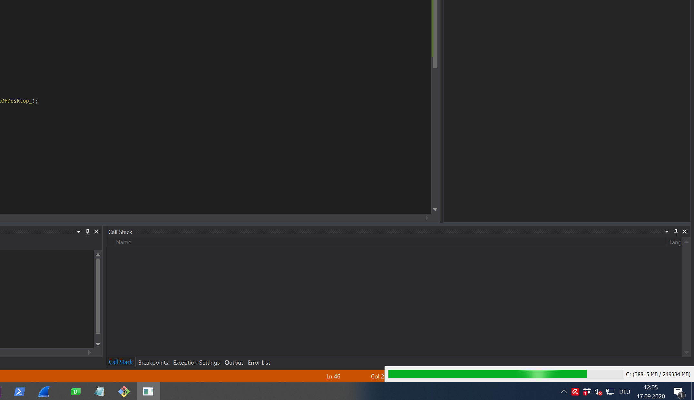

# StorageVisualizer

# Setup
The solution (Visual Studio 2015) makes use of a QTDIR Environment - variable. Set this to your QT - installation, for instance: QTDIR=C:\Qt\5.15.0\msvc2015_64

# Deployment
call deployment.bat to create the Deployment - folder with all necessary dlls

